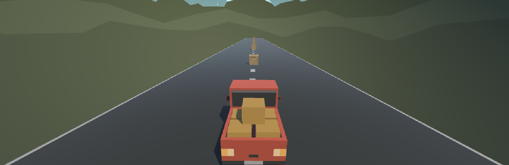
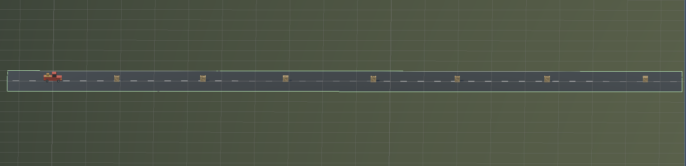

# My_First_Game

## Truck Game

I made my first game with Unity. While i was making this game, I learnt Unity's key features.

The purpose of this game is "driving the truck without hitting the boxes".

  

Right Arrow makes to move the truck to right side.     >

Left Arrow makes to move the truck to left side.       <   

Up Arrow makes to move the truck to forward side.      ^

Down Arrow makes to move the truck to backward side.    

  

I used a prototype file which has prepared some of assets. I have added C# codes on Visual Studio and made some settings on Unity.

The prototype file link: [Prototype 1 - Starter Files](https://drive.google.com/file/d/1k2DW6zWgWBsI0-d7XBciFtMHIBk31VpF/view?usp=sharing)

The video of game: [Video Link](https://drive.google.com/file/d/1vm9CYUTJFeq8myesqbJ1E_gStoaWIgjz/view?usp=sharing)

